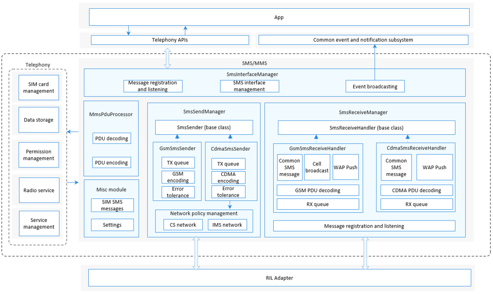

# SMS and MMS<a name="EN-US_TOPIC_0000001105544742"></a>


- [Introduction](#section117mcpsimp)
- [Directory Structure](#section125mcpsimp)
- [Constraints](#section129mcpsimp)
- [Available APIs](#section134mcpsimp)
- [Usage Guidelines](#section170mcpsimp)
  - [Sending SMS Messages](#section172mcpsimp)
  - [Creating a ShortMessage Object](#section181mcpsimp)
- [Repositories Involved](#section189mcpsimp)

## Introduction<a name="section117mcpsimp"></a>

The SMS and MMS module provides capabilities of sending and receiving short message service \(SMS\) messages and encoding and decoding multimedia messaging service \(MMS\) messages for mobile data users. Its main functions include the following: GSM/CDMA SMS message receiving and sending, SMS protocol data unit \(PDU\) encoding and decoding, WAP Push message receiving and processing, cell broadcast message receiving, MMS message notification, MMS message encoding and decoding, and SIM SMS record management.

**Figure  1**  Architecture of the SMS and MMS module<a name="fig420553511549"></a>


The SMS/MMS module consists of four major parts:  

-   **SmsInterfaceManager**: provides external APIs for sending SMS messages and managing SIM SMS records. It can be used to create **SmsSendManager** and **SmsReceiveManager** objects.
-   **SmsSendManager**: sends SMS messages and listens to IMS network status changes. It can be used to create **GsmSmsSender** and **CdmaSmsSender** objects and schedule either object based on the radio access technology \(RAT\) to send SMS messages.
-   **SmsReceiveManager**: receives SMS messages and listens to new SMS messages from the RIL Adapter layer. It can be used to create **GsmSmsReceiveHandler** and **CdmaSmsReceiveHandler** objects as well as the **SmsWapPushHandler** and **SmsCellBroadcastHandler** objects.
-   **MmsPduProcessor**: encodes and decodes MMS PDUs.

## Directory Structure<a name="section125mcpsimp"></a>

```
/base/telephony/sms_mms
├─ interfaces               # External APIs
│  └─ kits
├─ sa_profile               # SA profile
├─ services                 # Service code
│  ├─ include               # Header files
│  ├─ cdma                  # CDMA source files
│  ├─ gsm                   # GSM source files
├─ test                     # Unit test code
└─ utils                    # Utilities
```

## Constraints<a name="section129mcpsimp"></a>

-   Programming language: JavaScript
-   Software constraints: This module must work with the telephony core service \(core\_service\) and depends on the [glib](https://gitlab.gnome.org/GNOME/glib).
-   Hardware constraints: The accommodating device must be equipped with a modem and a SIM card capable of independent cellular communication. 

## Available APIs<a name="section134mcpsimp"></a>

**Table  1**  External APIs provided by the SMS and MMS module

| API| Description| Required Permission|
| ------------------------------------------------------------ | ------------------------------------------------------------ | ----------------------------------- |
| function sendMessage(options: SendMessageOptions): void;     | Sends SMS messages. This function uses an asynchronous callback to return the result.| SystemPermission.SEND_MESSAGES      |
| function createMessage(pdu: Array\<number>, specification: string, callback: AsyncCallback<ShortMessage>): void;| Creates an SMS message instance based on the PDU and the specified SMS protocol. This function uses an asynchronous callback to return the result.| None|
| function createMessage(pdu: Array\<number>, specification: string): Promise\<ShortMessage> | Creates an SMS message instance based on the PDU and the specified SMS protocol. This function uses a promise to return the result.| None|
| function getDefaultSmsSlotId(callback: AsyncCallback\<number>): void | Obtains the slot of the default SIM card used for sending SMS messages. This function uses an asynchronous callback to return the result.| None|
| function getDefaultSmsSlotId():Promise\<number>              | Obtains the slot of the default SIM card used for sending SMS messages. This function uses a promise to return the result.| None|
| function setSmscAddr(slotId: number, smscAddr: string, callback: AsyncCallback\<void>): void | Sets the Short Message Service Center (SMSC) address. This function uses an asynchronous callback to return the result, which is **undefined**.| ohos.permission.SET_TELEPHONY_STATE |
| function setSmscAddr(slotId: number, smscAddr: string): Promise\<void> | Sets the SMSC address. This function uses a promise to return the result, which is **undefined**.| ohos.permission.SET_TELEPHONY_STATE |
| function getSmscAddr(slotId: number, callback: AsyncCallback\<string>): void | Obtains the SMSC address. This function uses an asynchronous callback to return the result.| ohos.permission.GET_TELEPHONY_STATE |
| function getSmscAddr(slotId: number): Promise\<string>       | Obtains the SMSC address. This function uses a promise to return the result.| ohos.permission.GET_TELEPHONY_STATE |

**Table  2**  Description of SendMessageOptions

| Parameter| Type| Description| Mandatory|
| ---------------- | --------------------------------------------- | ---------------- | ---------------- |
| slotId           | number                                        | Card slot ID.| Yes|
| destinationHost  | string                                        | Phone number of the recipient.| Yes|
| serviceCenter    | string                                        | SMSC address.| No|
| content          | content \| Array\<number>                     | SMS message content.| Yes|
| destinationPort  | number                                        | Port number for receiving messages.| Yes (for sending of data messages)|
| sendCallback     | AsyncCallback\<ISendShortMessageCallback>     | Callback of the sending result.| Yes|
| deliveryCallback | AsyncCallback\<IDeliveryShortMessageCallback> | Callback of the delivery report.| Yes|

**Table  3**  Description of ISendShortMessageCallback

| Parameter| Type| Description|
| ---------- | ------------- | ------------------ |
| result     | SendSmsResult | Sending result.|
| url        | string        | URL address.|
| isLastPart | boolean       | Whether the SMS message is the last one.|

**Table  4**  Description of SendSmsResult

| Name| Value| Description|
| ------------------------------------ | ---- | ------------------------ |
| SEND_SMS_SUCCESS                     | 0    | The SMS message is sent successfully.|
| SEND_SMS_FAILURE_UNKNOWN             | 1    | Failed to send the SMS message due to an unknown reason.|
| SEND_SMS_FAILURE_RADIO_OFF           | 2    | Failed to send the SMS message because the modem is shut down.|
| SEND_SMS_FAILURE_SERVICE_UNAVAILABLE | 3    | Failed to send the SMS message because the network is unavailable.|

**Table  5**  Description of IDeliveryShortMessageCallback

| Parameter| Type| Description|
| ---- | -------------- | ------------------------------------------- |
| pdu  | Array\<number> | PDU array.|

**Table  6**  Parameters of createMessage

| Parameter| Type| Description|
| ------------- | -------------- | ------------------------------------------- |
| pdu           | Array\<number> | PDU array.|
| specification | string         | Protocol type (3GPP or 3GPP2).|

**Table 7** Parameters of getDefaultSmsSlotId

| Parameter| Type| Description|
| -------- | ---------------------- | -------------------------- |
| callback | AsyncCallback\<number> | Callback used to return the result. <br/>**0**: card slot 1<br/>**1**: card slot 2|

**Table 8** Parameters of setSmscAddr

| Name| Type| Mandatory| Description|
| -------- | -------------------- | ---- | --------------------------- |
| slotId   | number               | Yes| SIM card slot ID. The options are as follows:<br/>**0**: card slot 1<br/>**1**: card slot 2|
| smscAddr | string               | Yes| SMSC address.|
| callback | AsyncCallback\<void> | Yes| Callback used to return the result.|

**Table 9** Parameters of getSmscAddr

| Name| Type| Mandatory| Description|
| -------- | ---------------------- | ---- | --------------------------- |
| slotId   | number                 | Yes| SIM card slot ID. The options are as follows:<br/>**0**: card slot 1<br/>**1**: card slot 2|
| callback | AsyncCallback\<string> | Yes| Callback used to return the result.|

**Table 10** Variables of the ShortMessage callback

| Variable| Type| Description|
| ------------------------ | ------------------------------------------------------------ | ------------------------------------------------------------ |
| emailAddress             | string                                                       | Email address.|
| emailMessageBody         | string                                                       | Email body.|
| hasReplyPath             | boolean                                                      | Whether the received SMS contains **TP-Reply-Path**. The default value is **false**.<br/>**TP-Reply-Path**: the path in which the mobile phone can reply to the SMS message through the originating SMSC.|
| isEmailMessage           | boolean                                                      | Whether the received SMS message is an email.|
| isReplaceMessage         | boolean                                                      | Whether the received SMS message is a **replace short message**. The default value is **false**. For details, see section 9.2.3.9 in **3GPP TS 23.040**.|
| isSmsStatusReportMessage | boolean                                                      | Whether the received SMS message is an **SMS-Status-Report** message. The default value is **false**.<br/>**SMS-Status-Report**: a message sent from the SMSC to the mobile station to show the SMS message delivery status.|
| messageClass             | [ShortMessageClass](https://gitee.com/openharmony/telephony_sms_mms#section141712166453) | SMS message type.|
| pdu                      | Array\<number>                                               | PDU in the SMS message.|
| protocolId               | number                                                       | ID of the protocol used for sending SMS messages.|
| scAddress                | string                                                       | SMSC address.|
| scTimestamp              | number                                                       | SMSC timestamp.|
| status                   | number                                                       | SMS message status sent by the SMSC in the **SMS-STATUS-REPORT** message.|
| userRawData              | Array\<number>                                               | User data excluding the data header, that is, the SMS message content that is not decoded.|
| visibleMessageBody       | string                                                       | SMS message body.|
| visibleRawAddress        | string                                                       | Sender address.|


For details about the complete description of JavaScript APIs and sample code, see [SMS](https://gitee.com/openharmony/docs/blob/master/en/application-dev/js-reference/apis/js-apis-sms.md).

## Usage Guidelines<a name="section170mcpsimp"></a>

### Sending SMS Messages<a name="section172mcpsimp"></a> 

The function of sending a common SMS message is used as an example. The process is as follows:

1.  Construct a **SendMessageOptions** object with required parameters. If the sending result or delivery report is as expected, pass the **sendCallback** or **deliveryCallback** object.
2.  Call the **sendMessage** API in callback or promise mode.
3.  Obtain the sending result. The **sendMessage** API works in asynchronous mode. The sending result is returned through the callback.

    ```
    import sms from "@ohos.telephony.sms";

    let msg: SendMessageOptions = {
      slotId: 0,
      destinationHost: '123xxxxxxxx',
        content: 'This is an SMS message',
      sendCallback: (err, data) => {
        if (err) {
          // If the API call fails, err is not empty.
          console.error(`failed to send message because ${err.message}`);
          return;
        }
        // If the API call is successful, err is empty.
        console.log(`success to send message: ${data.result}`);
      }
    }

    // Call the sendMessage API.
    sms.sendMessage(msg);
    ```


### Creating a ShortMessage Object<a name="section181mcpsimp"></a>

The function of creating a **ShortMessage** object with a 3GPP PDU is used as an example. The process is as follows:

1.  Construct the PDU of the SMS message, with the protocol type set to **3GPP** or **3GPP2**.
2.  Call the **createMessage** API in callback or promise mode.
3.  The **createMessage** API works in asynchronous mode. After the API is called successfully, parse the **ShortMessage** object to obtain the SMS message content.

    ```
    import sms from "@ohos.telephony.sms";

    let pdu = [80, 80, 80]; // The array indicates the PDU of the SMS message other than a real SMS message.
    let specification = "3gpp";

    // Call the API in callback mode.
    sms.createMessage(pdu, specification, (err, value) => {
      if (err) {
        // If the API call fails, err is not empty.
        console.error(`failed to createMessage because ${err.message}`);
        return;
      }
      // If the API call is successful, err is empty.
      console.log(`success to createMessage: ${value}`);
    });

    // Call the API in promise mode.
    let promise = sms.createMessage(pdu, specification);
    promise.then((value) => {
      // The API call is successful.
      console.log(`success to createMessage: ${value}`);
    }).catch((err) => {
      // The API call fails.
      console.error(`failed to createMessage because ${err.message}`);
    });
    ```


## Repositories Involved<a name="section189mcpsimp"></a>

[Telephony Subsystem](https://gitee.com/openharmony/docs/blob/master/en/readme/telephony.md)

**telephony_sms_mms** 

[telephony_core_service](https://gitee.com/openharmony/telephony_core_service/blob/master/README.md)
